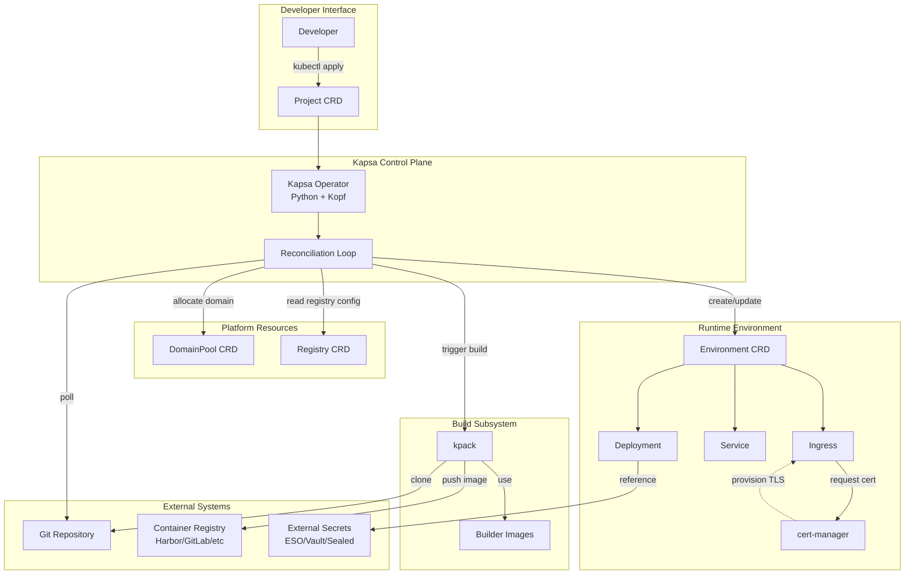
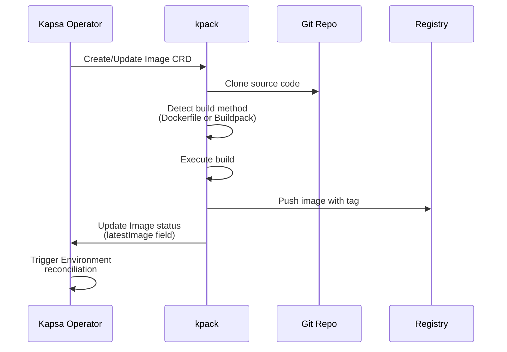
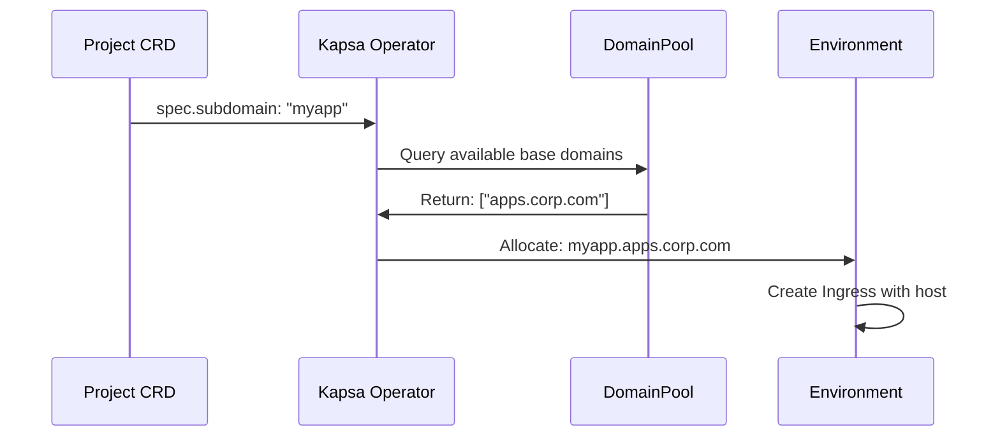
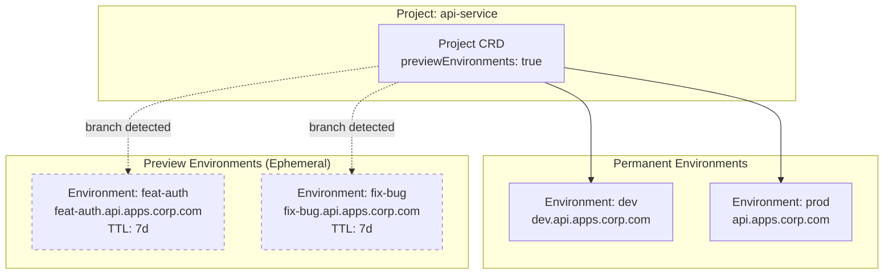
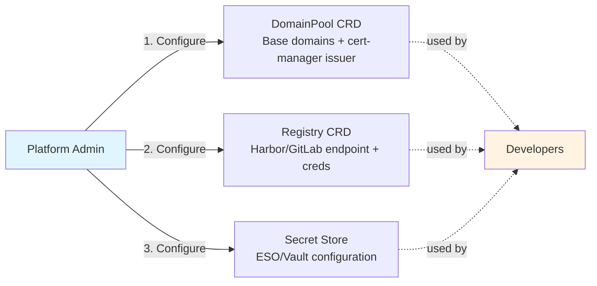

# Component Diagram

## High-Level Architecture

## Component Interaction Details

### Kapsa Operator

**Watches:**

- Project CRDs (all namespaces or configured namespaces)
- Environment CRDs (owned by Projects)
- DomainPool CRDs (cluster-scoped)
- Registry CRDs (cluster-scoped or namespace-scoped)

**Creates/Manages:**

- Namespaces (one per Project)
- ServiceAccounts (one per Project)
- Environment CRDs (per configured environment in Project)
- kpack Image resources (trigger builds)

**Reconciliation Triggers:**

- Project CRD create/update/delete
- Git repository changes (detected via polling)
- Environment CRD status changes
- kpack Image build completion

### Environment Controller

The Environment CRD is reconciled by the Kapsa operator to create runtime resources.

**Reads:**

- Environment spec (replicas, ports, ingress rules, resource limits)
- Project spec (image repository, domain configuration)
- DomainPool (to validate/allocate subdomains)

**Creates:**

- Deployment (application pods)
- Service (cluster networking)
- Ingress (external routing + TLS)
- HorizontalPodAutoscaler (optional, if autoscaling configured)

### Build Flow

### Domain Allocation Flow

## Preview Environment Architecture

**Preview Environment Lifecycle:**

1. Operator detects new branch in git repository
2. Creates ephemeral Environment CRD with `ownerReferences` to Project
3. Environment gets unique subdomain: `<branch-name>.<project-name>.<base-domain>`
4. On branch deletion or merge: Environment is deleted
5. On TTL expiry (default 7 days): Environment is deleted
6. Kubernetes garbage collection removes all child resources

## Platform Administrator Setup

Platform administrators set up infrastructure resources once; developers consume them via CRD references.
