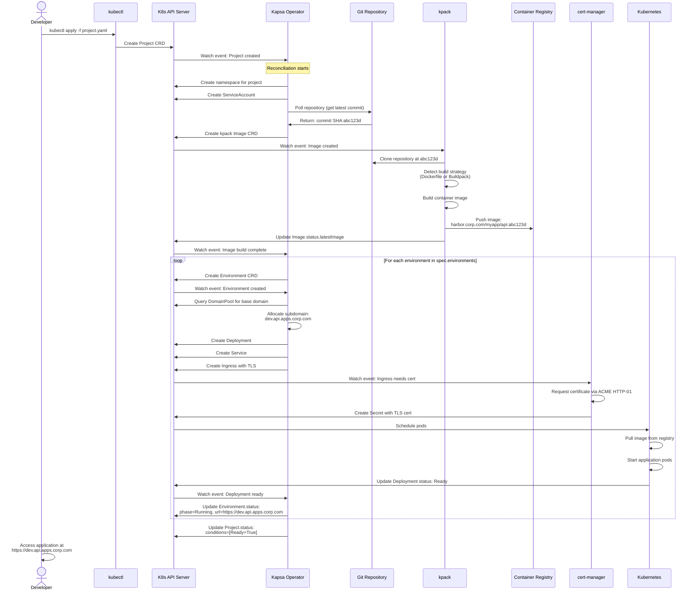
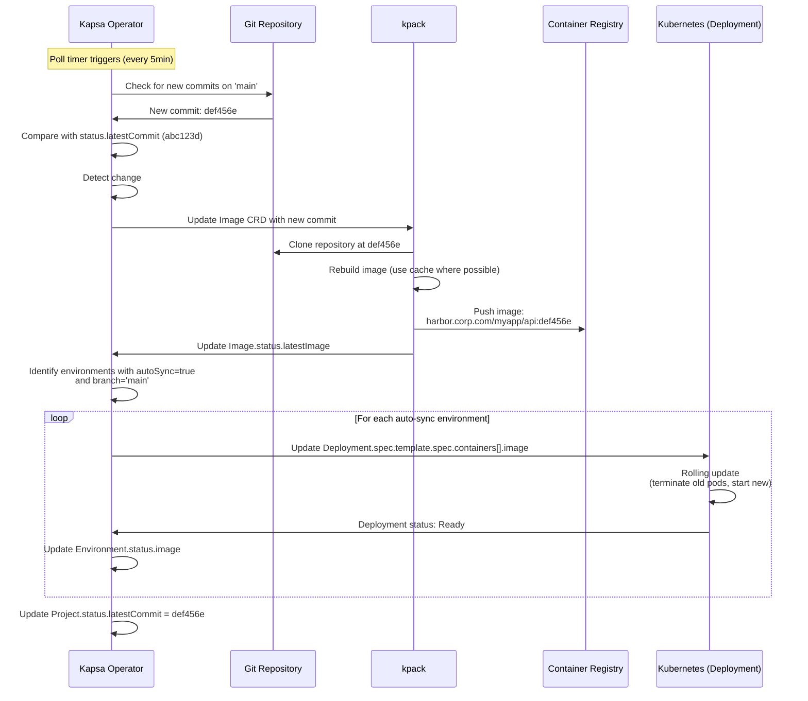
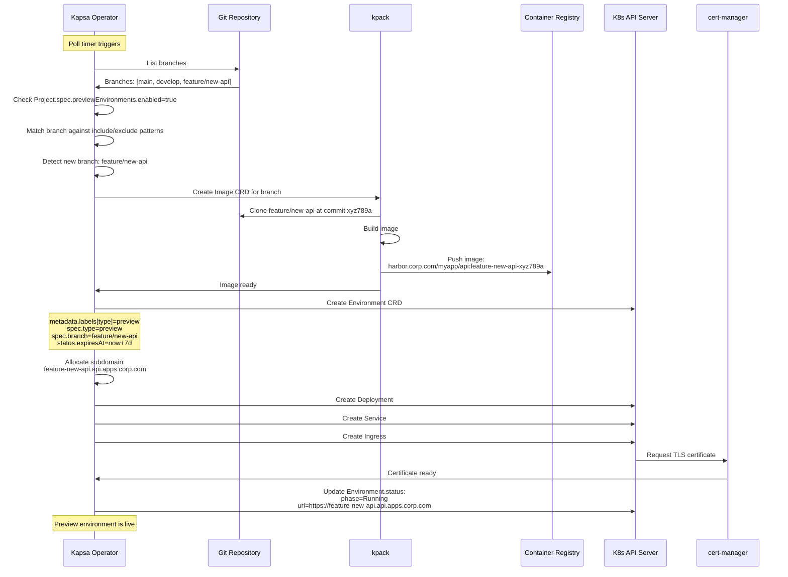
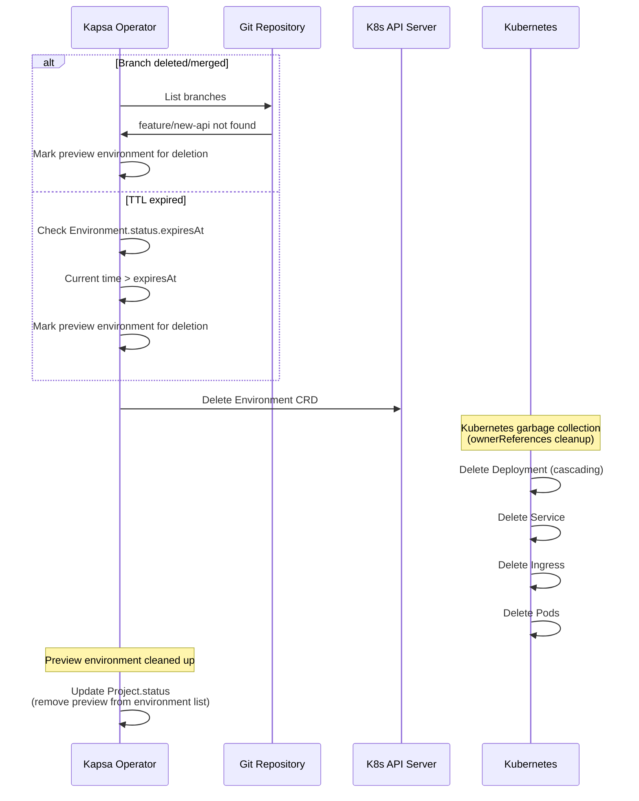
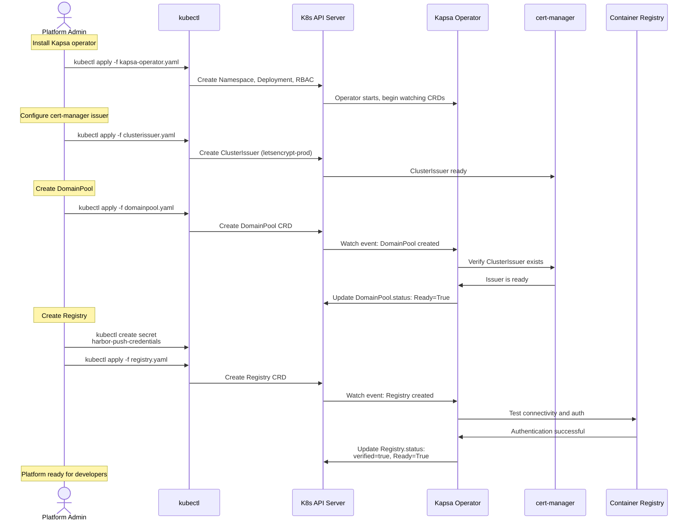
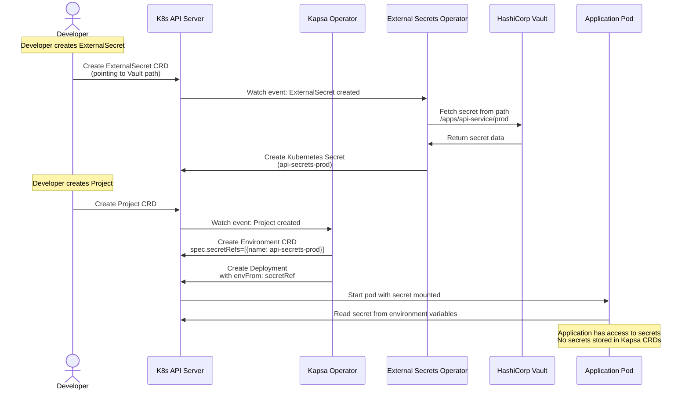
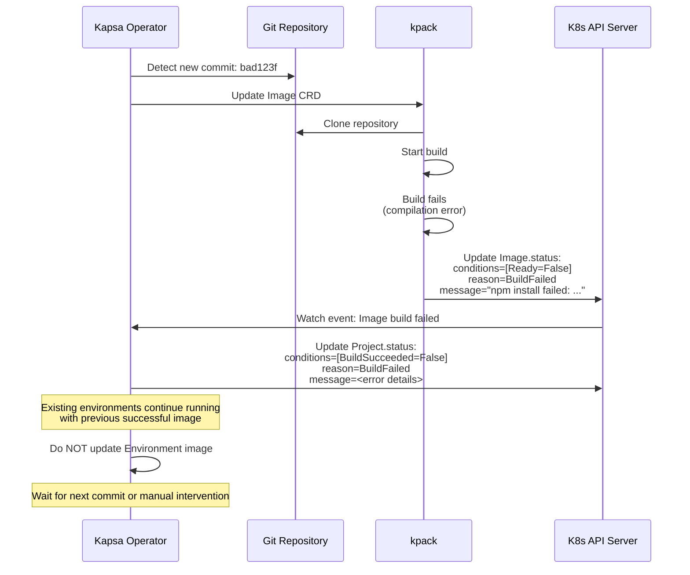

# Sequence Diagrams

## 1. Initial Project Deployment

Complete flow from Project creation to live application.

## 2. Source Code Update (Auto-Sync)

Flow when git repository changes are detected.

## 3. Preview Environment Creation

Flow when feature branch is detected.

## 4. Preview Environment Cleanup

Flow when preview environment expires or branch is deleted.

## 5. Platform Admin: Initial Setup

One-time setup flow for platform administrators.

## 6. Secret Management Integration (ESO Example)

Flow showing how external secrets are referenced (not stored in CRDs).

## 7. Build Failure Handling

Flow when kpack build fails.

## Key Timing and Behaviors

### Poll Intervals

- **Git repository polling**: Default 5 minutes (configurable per Project)
- **Reconciliation loop**: Triggered on CRD changes + periodic resync (10 minutes)

### Retry Behavior

- **Build failures**: No automatic retry; wait for next commit
- **Deployment failures**: Kubernetes handles pod restarts
- **Registry push failures**: kpack retries with exponential backoff

### Cleanup Behavior

- **Preview environments**: Deleted when branch removed OR TTL expires
- **Environment deletion**: Kubernetes garbage collection via `ownerReferences`
- **Namespace deletion**: Manual (platform admin must delete Project CRD)
